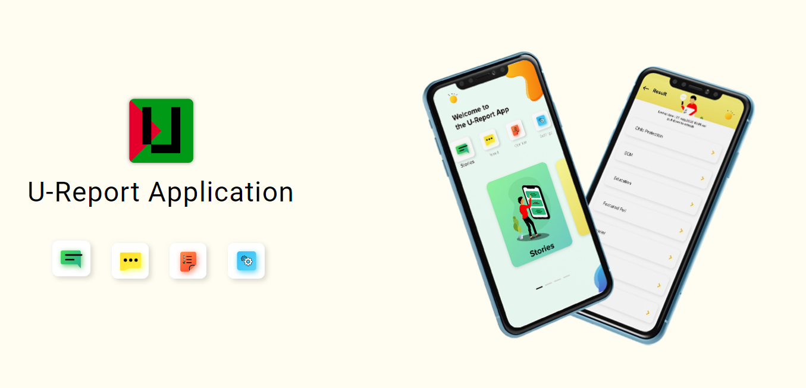

# U-Report Application
UReport app with offline feedback feature based on RapidPro and Offline Surveyor.

The whole system is based on 3 major components:
* RapidPro Server
* U-Report Offline Server
* U-Report Application

App Features:
* User Stories
* User Voice
* User Opinions
* Poll Results
* Text to Speech
* Connected with U-report Bangladesh
* English & Burmese Language Support
* Both Offline & Online Usability
* User & Data Security
* Back-end CMS
* Full Control on Content Management

RapidPro server(s) are used to add Surveyor flows, which in turn will run on U-Report Application. UReport Offline server process and converts flow run data from RapidPro into UReport format. UReport Application syncs data both UReport Offline and RapidPro server. The application also runs the survey from RapidPro.

Project documentation is available at:

<a href="https://riseup-labs.github.io/ureport-general/">https://riseup-labs.github.io/ureport-general/</a>

The application is available on Google Play Store.

Developed for <a href="https://www.unicef.org/bangladesh/" target="_blank">UNICEF Bangladesh</a> 
Designed & Developed by <a href="https://riseuplabs.com" target="_blank">Riseup Labs</a>